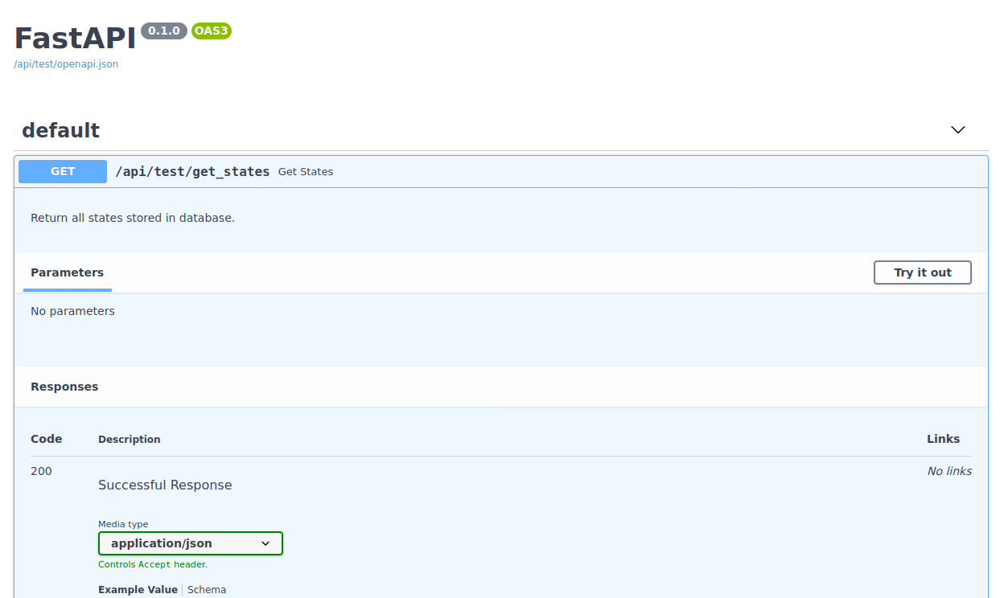

### Mikroserwisowa aplikacja do łączenia się z bazą "Northwind" w oparciu o PostgreSQL oraz FastApi


### Struktura projektu

Główny folder zawiera pliki niezbędne do stworzenia bazy, na której będziemy operować oraz przygotowania środowiska 
pracy. Znajdziemy w nim pliki konfiguracyjne takie jak: [docker-compose.yml](docker-compose.yml) umożliwiający 
dostosowanie kontenerów czy [nginx_config.conf](nginx_config.conf) odpowiedzialny za ustawienia serwera. Znajduje się 
tu również plik [northwind.sql](northwind.sql), dzięki któremu tworzona jest nasza baza.

Do folderu `docs` sukcesywnie będzię dodawana dokumentacja uzyskana podczas rozwijania projektu.

Serwisy komunikujące się z bazą danych zostaną stosownie dodane w odpowiednich folderach, przykładowo `test-service`.

### Uruchomienie

Wymagana jest wcześniejsza instalacja [dockera](https://www.docker.com/get-started) oraz 
[docker-compose](https://docs.docker.com/compose/install/). Następnie wykonujemy kolejno komendy w terminalu:

```
git clone https://github.com/ethru/northwind_psql.git
cd northwind_psql
docker-compose up
```

Po wykonaniu powyższych czynności jesteśmy w stanie komunikować się z naszym api za pomocą przeglądarki. By zobaczyć 
dokumentację oraz przetestować działanie danego serwisu należy przejść pod adres `http://0.0.0.0:8080/api/test/docs` 
(pokazane na przykładzie `test-service`).



Po kliknięciu na interesujący nas endpoint zostanie wyświetlony jego opis. Możemy wtedy użyć przycisku `Try it out` a 
następnie `Execute` by zobaczyć informację zwrotną z danego zapytania.
