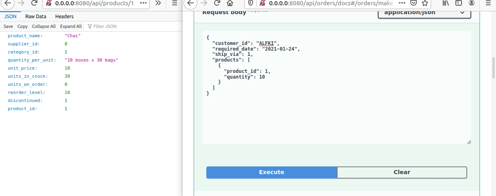
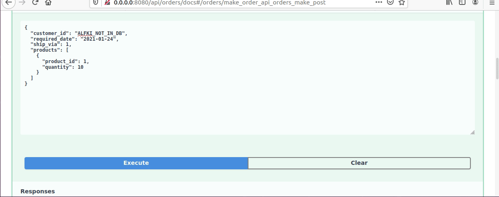

# FastAPI over Northwind PostgreSQL Database


## About

Sample implementation of microservices created with FastAPI and run by [Docker](https://www.docker.com/) over Northwind 
database [ported to PostgreSQL](https://github.com/pthom/northwind_psql). Endpoints authorization through HTTP Basic. 
Payment mechanism via PayPal sandbox. Monitoring and alerting with:

- [Prometheus](https://prometheus.io/):
    - http://0.0.0.0:9000/
- [Alertmanager](https://prometheus.io/docs/alerting/latest/alertmanager/):
    - http://0.0.0.0:9001/
- [Grafana](https://grafana.com/):
    - http://0.0.0.0:9002/
- [cAdvisor](https://github.com/google/cadvisor):
    - http://0.0.0.0:9003/

Performance of operations direct on database versus through API is shown [here](docs/Measurements.md).

Animation below illustrates making an order and not finalizing payment (changes to database are reversed after some time - 
shorter for example purpose):



### Build

To build project use [Docker Swarm](https://docs.docker.com/engine/swarm/). Follow instructions below:

```
git clone https://github.com/ethru/fastapi-over-northwind.git
cd fastapi-over-northwind
docker stack deploy app -c docker-compose.yml
```

To see service documentation and test it go to `http://0.0.0.0:8080/api/'service-name'/docs` in browser.

Note: during first run database is created and there can occur problem with connection from services listed below. If 
`502 Bad Gateway` shows up after going to services URLs restart them with:

```
docker service update --force app_categories_service
docker service update --force app_products_service
docker service update --force app_orders_service
docker service update --force app_reports_service
```

### Services

- http://0.0.0.0:8080/api/categories/docs
- http://0.0.0.0:8080/api/products/docs
- http://0.0.0.0:8080/api/orders/docs
- http://0.0.0.0:8080/api/reports/docs

### Endpoints


Manual tests of services can be done in Swagger UI (see photo). To send `DELETE` request click on it then press `Try it 
out` button and `Execute`. Result will appear below.

### Authorization

Some endpoints are protected with `HTTP Basic` against unauthorized access. They are marked with grey locker on the 
right side. To perform  action log in first. Press `Authorize` button or `locker` icon and pass authorization header 
into value field. It is created from [username
](https://github.com/ethru/fastapi-over-northwind/blob/master/secrets/login.txt) and [password
](https://github.com/ethru/fastapi-over-northwind/blob/master/secrets/password.txt). Default: `admin` and `password` 
which give header `Basic YWRtaW46cGFzc3dvcmQ=`. Feel free to modify linked files to your needs. Then generate header 
using for example this [tool](https://www.blitter.se/utils/basic-authentication-header-generator/).

### Tests

Animation shows manual tests performed through Swagger UI:



Tests are located in [tests](https://github.com/ethru/fastapi-over-northwind/tree/master/tests) directory. To run them 
install all dependencies first:

```shell
pip install pytest
pip install pytest-dependency
pip install pytest-ordering
```

Then build project. It is mandatory, because all tests are performed on live endpoints. When environment will be ready 
in main directory use command:

```python
python -m pytest tests
```


### License

This project is under the [Ms-PL License](LICENSE)
