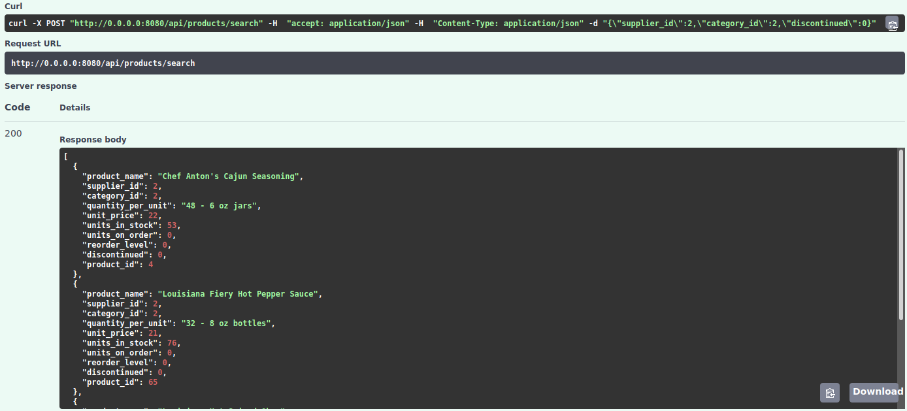
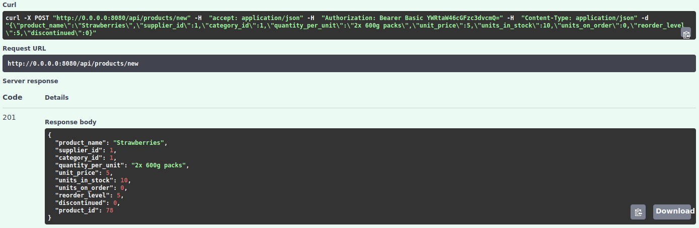
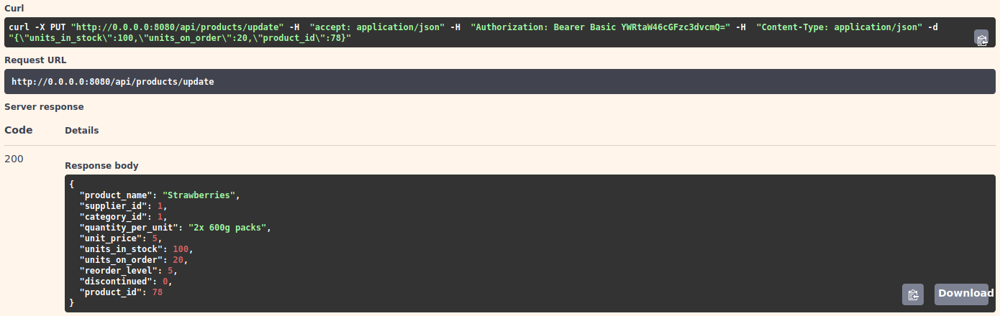
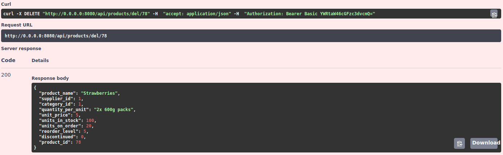

### Realizacja serwisu produktów

##### [/api/products/search](https://github.com/ethru/northwind_psql/blob/master/products-service/app/api/products.py#L35-L39)

[Zapytanie](https://github.com/ethru/northwind_psql/blob/master/products-service/app/api/db.py#L16-L28):

```python
async def search(payload: dict):
    """Get products matching payload from database.
    If there is no payload return all products.
    """
    if payload:
        conditions = [getattr(products.c, k) == v for k, v in payload.items()]
        query = select([text('*')]).where(and_(*conditions))
    else:
        query = products.select()

    print(query)
    return await database.fetch_all(query=query)
```

Funkcja `search` przyjmuje jako argument `payload` będący słownikiem przyporządkowującym kolumną w bazie wartości, po 
których produkty mają zostać wyszukane. Jeśli słownik będzie pusty to zostaną zwrócone wszystkie rekordy z tabeli 
`products`. Pod `if payload` widzimy rozpakowanie elementów słownika do listy warunków według, których nastąpi 
wyszukiwanie. Następnie zostają one przekazane do zapytania `select(...).where` gdzie łączymy je za pomocą `and_` z 
modułu `sqlalchemy.sql`. Na obiekcie `database` wywołujemy metodę `fetch_all`, do której przekazujemy `query`. 


Log z konsoli:


Wynik dla wartości supplier_id = 2, category_id = 2, discontinued = 0:



<br />
<br />
<br />
<br />

##### [/api/products/new](https://github.com/ethru/northwind_psql/blob/master/products-service/app/api/products.py#L42-L47)

[Zapytanie](https://github.com/ethru/northwind_psql/blob/master/products-service/app/api/db.py#L31-L38):

```python
async def add_product(payload: ProductIn):
    """Store new product in database."""
    query = products.insert().values(**payload.dict())
    print(query)
    try:
        return await database.execute(query=query)
    except ForeignKeyViolationError:
        raise HTTPException(status_code=422, detail='Wrong foreign key. Record with set id not in database.')
```

Funkcja `add_product` przyjmuje argument `payload` będący modelem `ProductIn` z modułu `pydantic` (opisany poniżej). 
Na tabeli `products` wywołana zostaje metoda `insert`, do której przekazujemy wartości z `payload`. W bloku `try-except` 
zwracamy `database.execute(query=query)`. Jeśli wystąpi wyjątek `ForeignKeyViolationError` związany z kluczem obcym 
`category_id` bądź `supplier_id` to w odpowiedzi otrzymamy błąd `HTTPException` o kodzie `422`.

Log z konsoli:


Wynik:



<br />
<br />
<br />
<br />

##### [/api/products/update](https://github.com/ethru/northwind_psql/blob/master/products-service/app/api/products.py#L50-L55)

[Zapytanie](https://github.com/ethru/northwind_psql/blob/master/products-service/app/api/db.py#L41-L50):
```python
async def update(payload: dict):
    """Update product with set id in database."""
    query = products.update().where(products.c.product_id == payload['product_id'])
    payload.pop('product_id')
    query = query.values(**payload).returning(products)
    print(query)
    try:
        return await database.fetch_one(query=query)
    except ForeignKeyViolationError:
        raise HTTPException(status_code=422, detail='Wrong foreign key. Record with set id not in database.')
```

Funkcja `upadte` przyjmuje jako argument `payload` będący słownikiem przyporządkowującym kolumną w bazie wartości do 
aktualizacji. Między nimi musi znaleźć się `product_id`. Gwarantuje to model `ProductUpdate` zastosowany przy 
endpointcie `/api/products/update` (opisany poniżej). Na tabeli `products` zostaje wywołana metoda `update` z warunkiem 
`where` określającym właściwy produkt. Następnie ze słownika usuwamy `product_id` i przekazujemy resztę jako kolumny 
oraz ich wartości do uaktualnienia. Zaznaczamy również, że w odpowiedzi chcemy otrzymać wszystkie dane nowo 
zaktualizowanego produktu `.returning(products)`. W bloku `try-except` zwracamy `database.fetch_one(query=query)`. Jeśli 
wystąpi wyjątek `ForeignKeyViolationError` związany z kluczem obcym `category_id` bądź `supplier_id` to w odpowiedzi 
otrzymamy błąd `HTTPException` o kodzie `422`. W wypadku kiedy id będzie błędne to zwrócimy w odpowiedzi `None`. Na 
zlinkowanym powyżej endpointcie `/api/products/update` możemy zobaczyć dekorator `@raise_404_if_none`, który w takim 
wypadku wywoła `HTTPException` o [kodzie 404
](https://github.com/ethru/northwind_psql/blob/master/products-service/app/api/products.py#L16-L24).

Log z konsoli:


Wynik dla wartości units_in_stock = 100, units_on_order = 20, product_id = 78 (stworzony wcześniej produkt):



<br />
<br />
<br />
<br />

##### [/api/products/del/{product_id}](https://github.com/ethru/northwind_psql/blob/master/products-service/app/api/products.py#L58-L63)

[Zapytanie](https://github.com/ethru/northwind_psql/blob/master/products-service/app/api/db.py#L53-L60):

```python
async def delete(product_id: int):
    """Remove product with set id from database.
    All linked orders and order_details are also deleted (cascade).
    """
    query = products.delete().where(products.c.product_id == product_id).returning(products)
    print(query)
    return await database.fetch_one(query=query)
```

Funkcja `delete` przyjmuje argument id produktu, który ma zostać usunięty. Na tabeli `products` wywołana zostaje metoda 
`delete` z warunkiem `where` określającym, który produkt ma zostać usunięty. Określamy za pomocą `.returning(products)`, 
że chcemy otrzymać z powrotem dane produktu. Na obiekcie `database` wywołujemy metodę `fetch_one`, do której 
przekazujemy `query`. W wypadku kiedy id będzie błędne to zwrócimy w odpowiedzi `None`. Na zlinkowanym powyżej 
endpointcie `/api/products/del/{product_id}` możemy zobaczyć dekorator `@raise_404_if_none`, który w takim wypadku 
wywoła `HTTPException` o [kodzie 404
](https://github.com/ethru/northwind_psql/blob/master/products-service/app/api/products.py#L16-L24).

Funkcja `delete` usuwa również rekordy z order_details przez wpis [ON DELETE CASCADE
](https://github.com/ethru/northwind_psql/blob/master/northwind.sql#L3836) w bazie danych. Zamiast tego można by było 
przykładowo skorzystać z podejścia opisanego w [przewodniku po technologii
](https://github.com/ethru/northwind_psql/blob/master/docs/Przewodnik.md#transakcje) pod sekcją transakcje.

Log z konsoli:


Wynik dla id = 78:



#### Modele danych

##### sqlalchemy

```python
products = Table(
    'products',
    metadata,
    Column('product_id', Integer, primary_key=True),
    Column('product_name', String),
    Column('supplier_id', Integer),
    Column('category_id', Integer),
    Column('quantity_per_unit', String),
    Column('unit_price', Integer),
    Column('units_in_stock', Integer),
    Column('units_on_order', Integer),
    Column('reorder_level', Integer),
    Column('discontinued', Integer),
    ForeignKeyConstraint(['supplier_id'], ['suppliers.supplier_id']),
    ForeignKeyConstraint(['category_id'], ['categories.category_id'])
)
```

Powyższy model odwzorowuje tabelę `products` z bazy danych. Importujemy poszczególne klasy z modułu `sqlalchemy` za 
pomocą `from sqlalchemy import Column, Integer, ForeignKeyConstraint, String, Table`. Kod dostępny jest pod [linkiem
](https://github.com/ethru/northwind_psql/blob/master/products-service/app/api/models.py#L8-L23).

##### pydantic

Modele odpowiedzialne za poprawność przesyłanych danych dostępne są [tutaj
](https://github.com/ethru/northwind_psql/blob/master/products-service/app/api/models.py#L26-L67) oraz wyglądają następująco:

```python
class ProductIn(BaseModel):
    product_name: str
    supplier_id: int
    category_id: int
    quantity_per_unit: str
    unit_price: int
    units_in_stock: int
    units_on_order: int
    reorder_level: int
    discontinued: int

    @validator('supplier_id', 'category_id', 'unit_price', 'units_in_stock', 'units_on_order', 'reorder_level')
    def value_must_be_greater_than_0(cls, number):
        if number >= 0:
            return number
        raise ValueError('must be greater or equal 0')

    @validator('discontinued')
    def discontinued_must_be_0_or_1(cls, number):
        if number == 0 or number == 1:
            return number
        raise ValueError('must be 0 or 1')


class ProductOut(ProductIn):
    product_id: int


class ProductUpdate(ProductOut):
    product_name: Optional[str] = None
    supplier_id: Optional[int] = None
    category_id: Optional[int] = None
    quantity_per_unit: Optional[str] = None
    unit_price: Optional[int] = None
    units_in_stock: Optional[int] = None
    units_on_order: Optional[int] = None
    reorder_level: Optional[int] = None
    discontinued: Optional[int] = None


class ProductSearch(ProductUpdate):
    product_id: Optional[int] = None
```

Ich użycie możemy zobaczyć przy poszczególnych [endpointach
](https://github.com/ethru/northwind_psql/blob/master/products-service/app/api/products.py#L27-L63):

```python
@products.get('/{product_id}', response_model=ProductOut)
@raise_404_if_none
async def get_by_id(product_id: int):
    ...

@products.post('/search', response_model=List[ProductOut])
async def search(payload: ProductSearch):
    ...

@products.post('/new', response_model=ProductOut, status_code=201, dependencies=[Depends(authorize)])
async def create(payload: ProductIn):
    ...

@products.put('/update', response_model=ProductOut, dependencies=[Depends(authorize)])
@raise_404_if_none
async def update(payload: ProductUpdate):
    ...

@products.delete('/del/{product_id}', response_model=ProductOut, dependencies=[Depends(authorize)])
@raise_404_if_none
async def delete(product_id: int):
    ...
```
