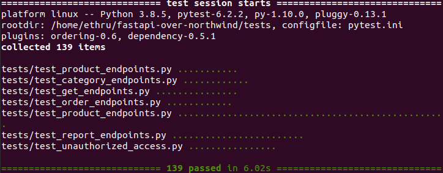

### Instrukcja

#### Uruchomienie

Wymagana jest wcześniejsza instalacja [dockera](https://www.docker.com/get-started) oraz 
[docker-compose](https://docs.docker.com/compose/install/). Następnie wykonujemy kolejno komendy w terminalu:

```
git clone https://github.com/ethru/northwind_psql.git
cd northwind_psql
docker-compose up
```

Po wykonaniu powyższych czynności jesteśmy w stanie komunikować się z naszym api za pomocą przeglądarki. By zobaczyć 
dokumentację oraz przetestować działanie danego serwisu należy przejść pod adres 
`http://0.0.0.0:8080/api/nazwa-serwisu/docs`.

*Uwaga:* jeśli żaden z serwisów nie jest dostępny przy pierwszym uruchomieniu `docker-compose'a`. Należy zatrzymać go 
`CTR+C` i wywołać komendę ponownie.

#### Serwisy

- http://0.0.0.0:8080/api/categories/docs
- http://0.0.0.0:8080/api/products/docs
- http://0.0.0.0:8080/api/orders/docs
- http://0.0.0.0:8080/api/reports/docs

#### Endpointy


Do testowania poszczególnych serwisów zaleca się korzystanie z UI Swaggera (zdjęcie powyżej). By przykładowo wysłać 
zapytanie `DELETE` naciskamy kolejno `Try it out` i po wprowadzeniu id produktu `Execute`. Kiedy obok adresu widnieje 
kłódka niezbędne jest zalogowanie by skorzystać z danej funkcjonalności.

#### Autoryzacja

Niektóre endpointy zabezpieczone są przed niepowołanym dostępem. Mogą z nich korzystać wyłącznie pracownicy znający 
login oraz hasło. Po naciśnięciu kłódki widocznej w prawym górnym rogu zdjęcia można wprowadzić nagłówek służący do 
autoryzacji.

Nagłówek można przykładowo wygenerować za pomocą 
[tego narzędzia](https://www.blitter.se/utils/basic-authentication-header-generator/). Domyślnie jest to Username: admin
, Password: password . Co daje nagłówek `Basic YWRtaW46cGFzc3dvcmQ=`. Można to zmienić w pliku `docker-compose.yml`.

#### Testy

Umieszczone są w katalogu [tests](https://github.com/ethru/northwind_psql/tree/master/tests) by je uruchomić należy 
najpierw zainstalować dodatki za pomocą terminala:

```shell
pip3 install pytest-dependency
pip3 install pytest-ordering
```

Następnie należy przejść do katalogu głównego projektu i wywołać (w momencie gdy projekt jest uruchomiony):

```python
python3 -m pytest tests
```


