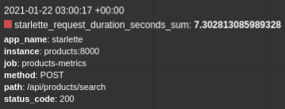

### Pomiary CRUD

#### Wykonanie

Pomiary zostały przeprowadzone dla wszystkich endpointów serwisu 
[products](https://github.com/ethru/northwind_psql/blob/master/products-service/app/api/products.py#L27-L63).
Szczegóły odnośnie sposobu zbierania pomiarów są dostępne [tutaj](Pomiary-opis.md).

#### Wyniki

##### [/api/products/new](https://github.com/ethru/northwind_psql/blob/master/products-service/app/api/products.py#L43-L47)

[Realizacja](https://github.com/ethru/northwind_psql/blob/master/products-service/app/api/db.py#L31-L38):
```python
async def add_product(payload: ProductIn):
    """Store new product in database."""
    query = products.insert().values(**payload.dict())
    print(query)
    try:
        return await database.execute(query=query)
    except ForeignKeyViolationError:
        raise HTTPException(status_code=422, detail='Wrong foreign key. Record with set id not in database.')
```

Zapytanie:


[Test DB](https://github.com/ethru/northwind_psql/blob/master/tests/measurements/db/product_create.sh):

```shell
for i in $(seq 1 100);
do
  psql -U admin -d northwind -c "INSERT INTO products (product_name, supplier_id, category_id, quantity_per_unit, unit_price, units_in_stock, units_on_order, reorder_level, discontinued) VALUES ('string', 1, 1, 'string', 0, 0, 0, 0, 0)"
done
```


[Test API](https://github.com/ethru/northwind_psql/blob/master/tests/measurements/api/product_create.sh):

```shell
for i in $(seq 1 100);
do
  curl -X POST "http://0.0.0.0:8080/api/products/new" -H  "accept: application/json" -H  "Authorization: Bearer Basic YWRtaW46cGFzc3dvcmQ=" -H  "Content-Type: application/json" -d "{\"product_name\":\"string\",\"supplier_id\":1,\"category_id\":1,\"quantity_per_unit\":\"string\",\"unit_price\":0,\"units_in_stock\":0,\"units_on_order\":0,\"reorder_level\":0,\"discontinued\":0}" &
done
```


<br />
<br />
<br />
<br />

##### [/api/products/update](https://github.com/ethru/northwind_psql/blob/master/products-service/app/api/products.py#L51-L55)

[Realizacja](https://github.com/ethru/northwind_psql/blob/master/products-service/app/api/db.py#L41-L50):

```python
async def update(payload: dict):
    """Update product with set id in database."""
    query = products.update().where(products.c.product_id == payload['product_id'])
    payload.pop('product_id')
    query = query.values(**payload).returning(products)
    print(query)
    try:
        return await database.fetch_one(query=query)
    except ForeignKeyViolationError:
        raise HTTPException(status_code=422, detail='Wrong foreign key. Record with set id not in database.')
```

Zapytanie:


[Test DB](https://github.com/ethru/northwind_psql/blob/master/tests/measurements/db/product_update.sh):

```shell
for i in $(seq 1 100);
do
  psql -U admin -d northwind -c "UPDATE products SET units_in_stock=100, units_on_order=10 WHERE products.product_id = $i RETURNING products.product_id, products.product_name, products.supplier_id, products.category_id, products.quantity_per_unit, products.unit_price, products.units_in_stock, products.units_on_order, products.reorder_level, products.discontinued"
done
```


[Test API](https://github.com/ethru/northwind_psql/blob/master/tests/measurements/api/product_update.sh):

```shell
for i in $(seq 1 100);
do
  curl -X PUT "http://0.0.0.0:8080/api/products/update" -H  "accept: application/json" -H  "Authorization: Bearer Basic YWRtaW46cGFzc3dvcmQ=" -H  "Content-Type: application/json" -d "{\"product_id\":$i,\"units_in_stock\":100,\"units_on_order\":10}" &
done
```


<br />
<br />
<br />
<br />

##### [/api/products/{product_id}](https://github.com/ethru/northwind_psql/blob/master/products-service/app/api/products.py#L28-L32)

[Realizacja](https://github.com/ethru/northwind_psql/blob/master/products-service/app/api/db.py#L9-L13):
```python
async def get_product(product_id: int):
    """Get product with set id from database."""
    query = products.select().where(products.c.product_id == product_id)
    print(query)
    return await database.fetch_one(query=query)
```

Zapytanie:


[Test DB](https://github.com/ethru/northwind_psql/blob/master/tests/measurements/db/product_select.sh):

```shell
for i in $(seq 1 100);
do
  psql -U admin -d northwind -c 'SELECT products.product_id, products.product_name, products.supplier_id, products.category_id, products.quantity_per_unit, products.unit_price, products.units_in_stock, products.units_on_order, products.reorder_level, products.discontinued FROM products WHERE products.product_id = 10'
done
```


[Test API](https://github.com/ethru/northwind_psql/blob/master/tests/measurements/api/product_select.sh):

```shell
for i in $(seq 1 100);
do
  curl -X GET "http://0.0.0.0:8080/api/products/10" -H  "accept: application/json" &
done
```


<br />
<br />
<br />
<br />

##### [/api/products/search](https://github.com/ethru/northwind_psql/blob/master/products-service/app/api/products.py#L36-L39)

[Realizacja](https://github.com/ethru/northwind_psql/blob/master/products-service/app/api/db.py#L16-L28):

```python
async def search(payload: dict):
    """Get products matching payload from database.
    If there is no payload return all products.
    """
    if payload:
        conditions = [getattr(products.c, k) == v for k, v in payload.items()]
        query = select([text('*')]).where(and_(*conditions))
    else:
        query = products.select()

    print(query)
    return await database.fetch_all(query=query)
```

Pomiar wykonywany dla search z parameterami. Wtedy użyta zostaje klauzula `WHERE`. W przypadku, gdy nie ma 
przekazywanych wartości zostają pobrane wszystkie produkty.

Zapytanie:


[Test DB](https://github.com/ethru/northwind_psql/blob/master/tests/measurements/db/product_search.sh):

```shell
for i in $(seq 1 100);
do
  psql -U admin -d northwind -c 'SELECT * FROM products WHERE products.category_id = 7 AND products.discontinued = 0'
done
```


[Test API](https://github.com/ethru/northwind_psql/blob/master/tests/measurements/api/product_search.sh):

```shell
for i in $(seq 1 100);
do
  curl -X POST "http://0.0.0.0:8080/api/products/search" -H  "accept: application/json" -H  "Content-Type: application/json" -d "{\"category_id\":1,\"units_on_order\":0,\"discontinued\":1}" &
done
```



<br />
<br />
<br />
<br />

##### [/api/products/del/{product_id}](https://github.com/ethru/northwind_psql/blob/master/products-service/app/api/products.py#L59-L63)

[Realizacja](https://github.com/ethru/northwind_psql/blob/master/products-service/app/api/db.py#L53-L60):

```python
async def delete(product_id: int):
    """Remove product with set id from database.
    
    All linked orders and order_details are also deleted (cascade).
    """
    query = products.delete().where(products.c.product_id == product_id).returning(products)
    print(query)
    return await database.fetch_one(query=query)
```

Zapytanie:


[Test DB](https://github.com/ethru/northwind_psql/blob/master/tests/measurements/db/product_delete.sh):

```shell
for i in $(seq 1 100);
do
  psql -U admin -d northwind -c "DELETE FROM products WHERE products.product_id = $i RETURNING products.product_id, products.product_name, products.supplier_id, products.category_id, products.quantity_per_unit, products.unit_price, products.units_in_stock, products.units_on_order, products.reorder_level, products.discontinued"
done
```


[Test API](https://github.com/ethru/northwind_psql/blob/master/tests/measurements/api/product_delete.sh):

```shell
for i in $(seq 1 100);
do
  curl -X DELETE "http://0.0.0.0:8080/api/products/del/$i" -H  "accept: application/json" -H  "Authorization: Bearer Basic YWRtaW46cGFzc3dvcmQ=" &
done
```


*Pomiar różni się formatowaniem ponieważ została użyta inna komenda. Prometheus otrzymał wyniki z `/api/products/del/1`,
`/del/2` ... `/del/100` jako osobne pomiary. Należało je najpierw pogrupować i zsumować za pomocą zapytania: 
`sum(starlette_request_duration_seconds_sum{method='DELETE'})`

<br />
<br />
<br />
<br />

#### Wnioski

Podsumowanie pomiarów znajduje się [tutaj](Pomiary-wnioski.md).
