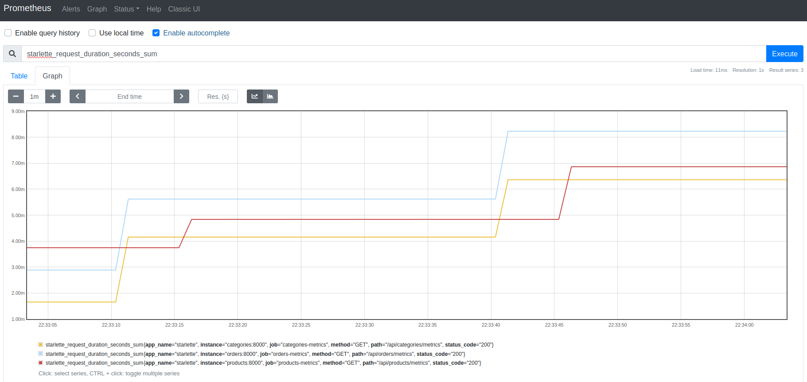

### Opis wykonywania pomiarów

Każde z zapytań, które zostały mierzone było wykonane 100 razy zarówno poprzez api jak i bezpośrednio w kontenerze 
przez uruchomienie skryptu `.sh`. Do uzyskania wyników posłużyła komenda `time` dla skryptu, natomiast dla pomiaru 
wyników z api zostało użyte narzędzie do monitoringu [Prometheus](https://prometheus.io/). Dodano je do 
[docker-compose.yml](https://github.com/ethru/northwind_psql/blob/master/docker-compose.yml#L153-L166), a jego pliki 
konfiguracyjne znajdują się w [tym](https://github.com/ethru/northwind_psql/tree/master/prometheus) folderze. Po 
zbudowaniu projektu możemy przejść pod adres `http://0.0.0.0:9000/graph` i wpisać odpowiednie zapytanie. Przykładowo:



By zmierzyć czas wykonania odpowiednich zapytań importujemy: `from starlette_exporter import PrometheusMiddleware, 
handle_metrics` w [pliku main](https://github.com/ethru/northwind_psql/blob/master/products-service/app/main.py#L2-L12) 
odpowiedniego serwisu i do instancji `FastAPI` dodajemy `app.add_middleware(PrometheusMiddleware)`. Teraz w pliku z 
naszymi endpointami, przykładowo 
[products](https://github.com/ethru/northwind_psql/blob/master/products-service/app/api/products.py#L12-L15) możemy 
użyć klasy `Summary` z modułu `prometheus_client` do ich dekorowania w celu zbierania metryk.

```python
request_metrics = Summary('request_processing_seconds', 'Time spent processing request')


@request_metrics.time()
@products.get('/{product_id}', response_model=ProductOut)
```

Do pobrania pomiarów dla kolejnych zapytań w `Prometheus UI` służyła komenda `starlette_request_duration_seconds_sum`, 
poza `delete` gdzie najpierw wyniki należało pogrupować i zsumować za pomocą: 
`sum(starlette_request_duration_seconds_sum{method='DELETE'})`.

### Nazewnictwo

Każdy z pomiarów nosi nazwę endpointu i do niego linkuje. Realizacja odnosi się do zapytań kierowanych do bazy danych. 
Wypisana jest również ich treść skopiowana z terminala po sprawdzeniu logów danego serwisu, przykładowo `docker logs 
products`. `Test DB` to bezpośrednie zapytania do bazy danych z pliku `.sh`. Natomiast `Test API` to pliki `.sh` 
generujące zapytania webowe.

### Kolejność

Testy wypisane są według uruchomienia.
