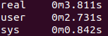
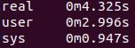

### Pomiary raportów

#### Wykonanie

Pomiary zostały przeprowadzone dla wszystkich endpointów serwisu 
[reports](https://github.com/ethru/northwind_psql/blob/master/reports-service/app/api/reports.py#L14-L46).
Szczegóły odnośnie sposobu zbierania pomiarów są dostępne [tutaj](Pomiary-opis.md).

#### Wyniki

##### [/api/reports/customers/profit](https://github.com/ethru/northwind_psql/blob/master/reports-service/app/api/reports.py#L14-L18)

[Realizacja](https://github.com/ethru/northwind_psql/blob/master/reports-service/app/api/db.py#L63-L87):
```python
async def get_sales_by_customer(from_date, to_date):
    """Return report about sales by customer in set period of time."""
    expression = order_details.c.unit_price * order_details.c.quantity * (1 - order_details.c.discount)
    query = select(
        [
            orders.c.customer_id,
            customers.c.company_name,
            func.round(func.sum(expression)).label('profit')
        ]
    ).select_from(
        join(join(orders, order_details, orders.c.order_id == order_details.c.order_id),
             customers, orders.c.customer_id == customers.c.customer_id)
    ).where(
        and_(
            orders.c.order_date >= from_date,
            orders.c.order_date <= to_date,
        )
    ).group_by(
        orders.c.customer_id,
        customers.c.company_name,
    ).order_by(
        desc('profit')
    )
    print(query)
    return await database.fetch_all(query=query)
```

Zapytanie:


[Test DB](https://github.com/ethru/northwind_psql/blob/master/tests/measurements/db/report_profit.sh):

```shell
for i in $(seq 1 100);
do
  psql -U admin -d northwind -c "SELECT orders.customer_id, customers.company_name, round(sum(order_details.unit_price * order_details.quantity * (1 - order_details.discount))) AS profit FROM orders JOIN order_details ON orders.order_id = order_details.order_id JOIN customers ON orders.customer_id = customers.customer_id WHERE orders.order_date >= '1996-07-10' AND orders.order_date <= '1996-07-17' GROUP BY orders.customer_id, customers.company_name ORDER BY profit DESC"
done
```


[Test API](https://github.com/ethru/northwind_psql/blob/master/tests/measurements/api/report_profit.sh):

```shell
for i in $(seq 1 100);
do
  curl -X POST "http://0.0.0.0:8080/api/reports/customers/profit" -H  "accept: application/json" -H  "Authorization: Bearer Basic YWRtaW46cGFzc3dvcmQ=" -H  "Content-Type: application/json" -d "{\"from_date\":\"1996-07-10\",\"to_date\":\"1996-07-17\"}" &
done
```


<br />
<br />
<br />
<br />

##### [/api/reports/employees/activity](https://github.com/ethru/northwind_psql/blob/master/reports-service/app/api/reports.py#L21-L25)

[Realizacja](https://github.com/ethru/northwind_psql/blob/master/reports-service/app/api/db.py#L14-L60):

```python
async def get_employees_activity(from_date, to_date):
    """Return report about employees activity in set period of time."""
    conditions = [
        orders.c.shipped_date >= from_date,
        orders.c.shipped_date <= to_date,
    ]
    return await get_employees_report(conditions)


async def get_employees_report(conditions: list):
    """Return report about employees according to set conditions."""
    query = select(
        [
            orders.c.employee_id,
            await get_full_employee_name(),
            employees.c.title,
            func.count(orders.c.employee_id).label('orders')
        ]
    ).select_from(
        orders.join(
            employees, orders.c.employee_id == employees.c.employee_id
        )
    ).where(
        and_(
            *conditions
        )
    ).group_by(
        orders.c.employee_id,
        employees.c.first_name,
        employees.c.last_name,
        employees.c.title,
        employees.c.title_of_courtesy
    ).order_by(
        desc('orders')
    )
    print(query)
    return await database.fetch_all(query=query)


# Funkcja pomocnicza - formatująca dane pracownika
async def get_full_employee_name():
    """Return concat function with full employee name."""
    blank = text("' '")
    full_name = [employees.c.title_of_courtesy, blank, employees.c.first_name, blank, employees.c.last_name]
    return func.concat(*full_name).label('employee')
```

Zapytanie:


[Test DB](https://github.com/ethru/northwind_psql/blob/master/tests/measurements/db/report_activity.sh):

```shell
for i in $(seq 1 100);
do
  psql -U admin -d northwind -c "SELECT orders.employee_id, concat(employees.title_of_courtesy, ' ', employees.first_name, ' ', employees.last_name) AS employee, employees.title, count(orders.employee_id) AS orders FROM orders JOIN employees ON orders.employee_id = employees.employee_id WHERE orders.shipped_date >= '1996-07-10' AND orders.shipped_date <= '1996-07-17' GROUP BY orders.employee_id, employees.first_name, employees.last_name, employees.title, employees.title_of_courtesy ORDER BY orders DESC"
done
```


[Test API](https://github.com/ethru/northwind_psql/blob/master/tests/measurements/api/report_activity.sh):

```shell
for i in $(seq 1 100);
do
  curl -X POST "http://0.0.0.0:8080/api/reports/employees/activity" -H  "accept: application/json" -H  "Authorization: Bearer Basic YWRtaW46cGFzc3dvcmQ=" -H  "Content-Type: application/json" -d "{\"from_date\":\"1996-07-10\",\"to_date\":\"1996-07-17\"}" &
done
```


<br />
<br />
<br />
<br />

##### [/api/reports/employees/delays](https://github.com/ethru/northwind_psql/blob/master/reports-service/app/api/reports.py#L28-L32)

[Realizacja](https://github.com/ethru/northwind_psql/blob/master/reports-service/app/api/db.py#L23-L60):
```python
async def get_employees_shipment_delays(from_date, to_date):
    """Return report about employees shipment delays in set period of time."""
    conditions = [
        orders.c.shipped_date >= from_date,
        orders.c.shipped_date <= to_date,
        orders.c.shipped_date > orders.c.required_date
    ]
    return await get_employees_report(conditions)


async def get_employees_report(conditions: list):
    """Return report about employees according to set conditions."""
    query = select(
        [
            orders.c.employee_id,
            await get_full_employee_name(),
            employees.c.title,
            func.count(orders.c.employee_id).label('orders')
        ]
    ).select_from(
        orders.join(
            employees, orders.c.employee_id == employees.c.employee_id
        )
    ).where(
        and_(
            *conditions
        )
    ).group_by(
        orders.c.employee_id,
        employees.c.first_name,
        employees.c.last_name,
        employees.c.title,
        employees.c.title_of_courtesy
    ).order_by(
        desc('orders')
    )
    print(query)
    return await database.fetch_all(query=query)


# Funkcja pomocnicza - formatująca dane pracownika
async def get_full_employee_name():
    """Return concat function with full employee name."""
    blank = text("' '")
    full_name = [employees.c.title_of_courtesy, blank, employees.c.first_name, blank, employees.c.last_name]
    return func.concat(*full_name).label('employee')
```

Zapytanie:


[Test DB](https://github.com/ethru/northwind_psql/blob/master/tests/measurements/db/report_delays.sh):

```shell
for i in $(seq 1 100);
do
  psql -U admin -d northwind -c "SELECT orders.employee_id, concat(employees.title_of_courtesy, ' ', employees.first_name, ' ', employees.last_name) AS employee, employees.title, count(orders.employee_id) AS orders FROM orders JOIN employees ON orders.employee_id = employees.employee_id WHERE orders.shipped_date >= '1996-07-10' AND orders.shipped_date <= '1997-07-17' AND orders.shipped_date > orders.required_date GROUP BY orders.employee_id, employees.first_name, employees.last_name, employees.title, employees.title_of_courtesy ORDER BY orders DESC"
done
```




[Test API](https://github.com/ethru/northwind_psql/blob/master/tests/measurements/api/report_delays.sh):

```shell
for i in $(seq 1 100);
do
  curl -X POST "http://0.0.0.0:8080/api/reports/employees/delays" -H  "accept: application/json" -H  "Authorization: Bearer Basic YWRtaW46cGFzc3dvcmQ=" -H  "Content-Type: application/json" -d "{\"from_date\":\"1996-07-10\",\"to_date\":\"1997-07-17\"}" &
done
```


<br />
<br />
<br />
<br />

##### [/api/reports/products/popularity](https://github.com/ethru/northwind_psql/blob/master/reports-service/app/api/reports.py#L35-L39)

[Realizacja](https://github.com/ethru/northwind_psql/blob/master/reports-service/app/api/db.py#L90-L116):

```python
async def get_products_by_popularity(from_date, to_date):
    """Return report about products by popularity in set period of time."""
    query = select(
        [
            order_details.c.product_id,
            products.c.product_name,
            categories.c.category_name,
            func.sum(order_details.c.quantity).label('sold')
        ]
    ).select_from(
        join(join(join(orders, order_details, orders.c.order_id == order_details.c.order_id),
                  products, products.c.product_id == order_details.c.product_id),
             categories, products.c.category_id == categories.c.category_id)
    ).where(
        and_(
            orders.c.order_date >= from_date,
            orders.c.order_date <= to_date,
        )
    ).group_by(
        order_details.c.product_id,
        products.c.product_name,
        categories.c.category_name,
    ).order_by(
        desc('sold')
    )
    print(query)
    return await database.fetch_all(query=query)
```

Zapytanie:


[Test DB](https://github.com/ethru/northwind_psql/blob/master/tests/measurements/db/report_popularity.sh):

```shell
for i in $(seq 1 100);
do
  psql -U admin -d northwind -c "SELECT order_details.product_id, products.product_name, categories.category_name, sum(order_details.quantity) AS sold FROM orders JOIN order_details ON orders.order_id = order_details.order_id JOIN products ON products.product_id = order_details.product_id JOIN categories ON products.category_id = categories.category_id WHERE orders.order_date >= '1996-07-10' AND orders.order_date <= '1996-07-17' GROUP BY order_details.product_id, products.product_name, categories.category_name ORDER BY sold DESC"
done
```



[Test API](https://github.com/ethru/northwind_psql/blob/master/tests/measurements/api/report_popularity.sh):

```shell
for i in $(seq 1 100);
do
  curl -X POST "http://0.0.0.0:8080/api/reports/products/popularity" -H  "accept: application/json" -H  "Authorization: Bearer Basic YWRtaW46cGFzc3dvcmQ=" -H  "Content-Type: application/json" -d "{\"from_date\":\"1996-07-10\",\"to_date\":\"1996-07-17\"}" &
done
```


<br />
<br />
<br />
<br />

##### [/api/reports/products/reorder](https://github.com/ethru/northwind_psql/blob/master/reports-service/app/api/reports.py#L42-L46)

[Realizacja](https://github.com/ethru/northwind_psql/blob/master/reports-service/app/api/db.py#L119-L148):

```python
async def get_products_to_reorder():
    """Return report about products to reorder."""
    available = products.c.units_in_stock - products.c.units_on_order
    contact = func.concat(suppliers.c.contact_title, text("': '"), suppliers.c.contact_name,
                          text("' via '"), suppliers.c.phone)
    to_reorder = available - products.c.reorder_level

    query = select(
        [
            products.c.product_id,
            products.c.product_name,
            categories.c.category_name,
            products.c.units_in_stock,
            products.c.units_on_order,
            available.label('units_available'),
            products.c.reorder_level,
            suppliers.c.company_name.label('supplier'),
            contact.label('contact')
        ]
    ).select_from(
        join(join(products, suppliers, products.c.supplier_id == suppliers.c.supplier_id),
             categories, products.c.category_id == categories.c.category_id)
    ).where(
        and_(
            products.c.discontinued == 0,
            to_reorder <= 0
        )
    )
    print(query)
    return await database.fetch_all(query=query)
```

Zapytanie:


[Test DB](https://github.com/ethru/northwind_psql/blob/master/tests/measurements/db/report_reorder.sh):

```shell
for i in $(seq 1 100);
do
  psql -U admin -d northwind -c "SELECT products.product_id, products.product_name, categories.category_name, products.units_in_stock, products.units_on_order, products.units_in_stock - products.units_on_order AS units_available, products.reorder_level, suppliers.company_name AS supplier, concat(suppliers.contact_title, ': ', suppliers.contact_name, ' via ', suppliers.phone) AS contact FROM products JOIN suppliers ON products.supplier_id = suppliers.supplier_id JOIN categories ON products.category_id = categories.category_id WHERE products.discontinued = 0 AND (products.units_in_stock - products.units_on_order) - products.reorder_level <= 0"
done
```


[Test API](https://github.com/ethru/northwind_psql/blob/master/tests/measurements/api/report_reorder.sh):

```shell
for i in $(seq 1 100);
do
  curl -X GET "http://0.0.0.0:8080/api/reports/products/reorder" -H  "accept: application/json" -H  "Authorization: Bearer Basic YWRtaW46cGFzc3dvcmQ=" &
done
```


<br />
<br />
<br />
<br />

#### Wnioski

Podsumowanie pomiarów znajduje się [tutaj](Pomiary-wnioski.md).
