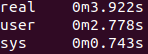

### Pomiary

#### Przygotowanie

Pomiary zostały przeprowadzone dla tabeli `products`. Każde z poniższych zapytań zostało wykonane 100 razy zarówno 
poprzez api jak i bezpośrednio w kontenerze przez uruchomienie skryptu `.sh`. Do uzyskania wyników posłużyła komenda 
`time` dla skryptu, natomiast dla pomiaru wyników z api zostało użyte narzędzie do monitoringu 
[Prometheus](https://prometheus.io/). Dodano je do 
[docker-compose.yml](https://github.com/ethru/northwind_psql/blob/master/docker-compose.yml#L83-L93), a jego pliki 
konfiguracyjne znajdują się w [tym](https://github.com/ethru/northwind_psql/tree/master/prometheus) folderze. Po 
zbudowaniu projektu możemy przejść pod adres `http://0.0.0.0:9000/graph` i wpisać odpowiednie zapytanie. Przykładowo:


By zmierzyć czas wykonania odpowiednich zapytań importujemy: `from starlette_exporter import PrometheusMiddleware, 
handle_metrics` w [pliku main](https://github.com/ethru/northwind_psql/blob/master/products-service/app/main.py#L2-L12) 
serwisu products i do instancji `FastAPI` dodajemy `app.add_middleware(PrometheusMiddleware)`. Teraz w pliku 
[products](https://github.com/ethru/northwind_psql/blob/master/products-service/app/api/products.py#L12-L15) możemy 
użyć klasy `Summary` z modułu `prometheus_client` do dekorowania naszych endpointów w celu zbierania metryk.

```python
request_metrics = Summary('request_processing_seconds', 'Time spent processing request')


@request_metrics.time()
@products.get('/{product_id}', response_model=ProductOut)
```

Do pobrania pomiarów dla kolejnych zapytań w `Prometheus UI` służyła komenda `starlette_request_duration_seconds_sum`, 
poza `delete` gdzie najpierw wyniki należało pogrupować i zsumować: 
`sum(starlette_request_duration_seconds_sum{method='DELETE'})`.

#### Wyniki

Dla wszystkich endpointów serwisu products. Linkowane przez nazwę. Realizacja odnosi się do zapytań kierowanych do bazy 
danych. Odzwierciedlenie do bezpośrednich zapytań stosowanych w pliku `.sh`. Natomiast test przenosi do pliku `.sh` 
generującego zapytania

##### [get_by_id](https://github.com/ethru/northwind_psql/blob/master/products-service/app/api/products.py#L17-L22)

[Realizacja](https://github.com/ethru/northwind_psql/blob/master/products-service/app/api/db.py#L8-L10):
```python
async def get_product(product_id: int):
    """Get product with set id from database."""
    return await database.fetch_one(query=products.select().where(products.c.product_id == product_id))
```

[Odzwierciedlenie](https://github.com/ethru/northwind_psql/blob/master/tests/time/db_product_select.sh):
```shell
for i in $(seq 1 100);
do
  psql -U northwind_user -d northwind -c 'SELECT * FROM products WHERE product_id = 10'
done
```

[Test](https://github.com/ethru/northwind_psql/blob/master/tests/time/api_product_select.sh). Wynik:

DB:


API:


##### [search](https://github.com/ethru/northwind_psql/blob/master/products-service/app/api/products.py#L27-L30)

[Realizacja](https://github.com/ethru/northwind_psql/blob/master/products-service/app/api/db.py#L13-L27):
```python
async def search(payload: dict):
    """Get products matching payload from database.
    If there is no payload return all products.
    """
    if not payload:
        return await database.fetch_all(query=products.select())

    payload = {k: f"'{v}'" if isinstance(v, str) else v for k, v in payload.items()}
    condition = ' AND '.join([f'{k}={v}' for k, v in payload.items()])
    query = f'SELECT * FROM products WHERE {condition}'
    result = []
    async for row in database.iterate(query=query):
        result.append(row)
    return result
```

Pomiar wykonywany dla search z parameterami. Wtedy użyta zostaje klauzula `WHERE`. W przypadku, gdy nie ma 
przekazywanych wartości zostają pobrane wszystkie produkty.

[Odzwierciedlenie](https://github.com/ethru/northwind_psql/blob/master/tests/time/db_product_search.sh):
```shell
for i in $(seq 1 100);
do
  psql -U northwind_user -d northwind -c 'SELECT * FROM products WHERE category_id = 1 AND discontinued = 1'
done
```

[Test](https://github.com/ethru/northwind_psql/blob/master/tests/time/api_product_search.sh). Wynik:

DB:


API:


##### [create](https://github.com/ethru/northwind_psql/blob/master/products-service/app/api/products.py#L35-L38)

[Realizacja](https://github.com/ethru/northwind_psql/blob/master/products-service/app/api/db.py#L30-L36):
```python
async def add_product(payload: ProductIn):
    """Store new product in database."""
    query = products.insert().values(**payload.dict())
    try:
        return await database.execute(query=query)
    except ForeignKeyViolationError:
        raise HTTPException(status_code=422, detail='Wrong foreign key. Record with set id not in database.')
```

[Odzwierciedlenie](https://github.com/ethru/northwind_psql/blob/master/tests/time/db_product_create.sh):
```shell
for i in $(seq 1 100);
do
  psql -U northwind_user -d northwind -c "INSERT INTO products VALUES (DEFAULT, 'string', 1, 1, 'string', 0, 0, 0, 0, 0)"
done
```

[Test](https://github.com/ethru/northwind_psql/blob/master/tests/time/api_product_create.sh). Wynik:

DB:



API:


##### [update](https://github.com/ethru/northwind_psql/blob/master/products-service/app/api/products.py#L43-L52)

[Realizacja](https://github.com/ethru/northwind_psql/blob/master/products-service/app/api/db.py#L39-L47):
```python
async def update(payload: ProductOut):
    """Update product with set id in database."""
    query = products.update().where(
        products.c.product_id == payload.product_id
    ).values(**payload.dict()).returning(products)
    try:
        return await database.execute(query=query)
    except ForeignKeyViolationError:
        raise HTTPException(status_code=422, detail='Wrong foreign key. Record with set id not in database.')
```

[Odzwierciedlenie](https://github.com/ethru/northwind_psql/blob/master/tests/time/db_product_update.sh):
```shell
for i in $(seq 1 100);
do
  psql -U northwind_user -d northwind -c "UPDATE products SET units_in_stock = 100, units_on_order = 10 WHERE product_id = $i RETURNING *"
done
```

[Test](https://github.com/ethru/northwind_psql/blob/master/tests/time/api_product_update.sh). Wynik:

DB:


API:


##### [delete](https://github.com/ethru/northwind_psql/blob/master/products-service/app/api/products.py#L57-L62)

[Realizacja](https://github.com/ethru/northwind_psql/blob/master/products-service/app/api/db.py#L50-L56):
```python
async def delete(product_id: int):
    """Remove product with set id from database.
    All linked orders and order_details are also deleted (cascade).
    """
    query = products.delete().where(products.c.product_id == product_id).returning(products)
    return await database.execute(query=query)
```

[Odzwierciedlenie](https://github.com/ethru/northwind_psql/blob/master/tests/time/db_product_delete.sh):
```shell
for i in $(seq 1 100);
do
  psql -U northwind_user -d northwind -c "DELETE FROM products WHERE product_id = $i RETURNING *"
done
```

[Test](https://github.com/ethru/northwind_psql/blob/master/tests/time/api_product_delete.sh). Wynik:

DB:


API:


#### Wnioski

Przy prostych operacjach takich jak `select` różnica w czasie jest stosunkowo niewielka. Możemy zaobserwować to przy 
pomiarze dla `get_by_id`. W momencie kiedy dodajemy nieco operacji po stronie serwera jak przy `search` czas wzrasta, 
ale wciąż nie jest on tak duży jak w wypadku porównania `create`. Tu widzimy trzykrotność prędkości wykonania operacji 
bezpośrednio na bazie. Różnica robi się jeszcze większa przy `update` - jest to pięciokrotność. Pomiar `delete` dał nam 
co prawda mniejszy wynik, ale wciąż jest on cztery razy większy od czasu wykonania bezpośrednich zapytań. Co do wyników 
oczywiście należy przyjąć pewną poprawkę ze względu na to, że API komunikowało się z bazą poprzez jej kontener. 
Natomiast skrypty `.sh` były uruchamiane w jego wnętrzu co mogło również wpłynąć na pomiary. Trzeba też przyjąć, że 
pewien czas został poświęcony na walidację modeli i kod zależny od danego endpointu. Nie mniej jednak różnice w 
przypadku bardziej skomplikowanych operacji są spore i przy projektowaniu tego typu aplikacji należy mieć to na uwadzę.
