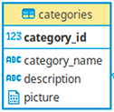

### Połączenie

#### db.py

W projekcie wykorzystywany jest ORM [SQLAlchemy](https://docs.sqlalchemy.org/en/13/orm/). Do połączenia z bazą danych 
używamy funkcję `create_engine` i klasę `MetaData`. Jako argument funkcji podajemy URI. Ma ono postać: 
`postgresql://northwind_user:thewindisblowing@db/northwind` i jest przechowywane w pliku [docker-compose.yml
](https://github.com/ethru/northwind_psql/blob/master/docker-compose.yml#L27). By odwołać się do niego należy skorzystać 
z modułu `os` i je pobrać `DATABASE_URI = os.getenv('DATABASE_URI')`. Następnym krokiem jest stworzenie modelu danych, 
do których będziemy się odnosić (omówione bardziej szczegółowo w kolejnym punkcie). Do pisania zapytań użyty został 
[moduł `databases`](https://www.encode.io/databases/) gdzie do klasy `Database` również przekazujemy wcześniej uzyskane 
URI. Przykład dostępny 
[tutaj](https://github.com/ethru/northwind_psql/blob/master/common/__init__.py#L1-L11).

#### main.py

Importujemy silnik, bazę i metadane z pliku `db.py` - `from app.api.db import database, engine, metadata`. Wywołujemy 
`metadata.create_all(engine)`, a następnie tworzymy zdarzenia inicjujące oraz zamykające połączenie z bazą za pomocą 
dekoratorów `@app.on_event("startup")` oraz `@app.on_event("shutdown")` gdzie `app` to instancja `FastAPI`. Odpowiednio 
używamy `database.connect()` lub `database.disconnect()`. Całość kodu dostępna jest [tu
](https://github.com/ethru/northwind_psql/blob/master/categories-service/app/main.py#L4-L23).

### Modele danych

Omówione na podstawie tabeli `categories`, poniżej widoczny jej schemat:



#### SQLAlchemy

Do odzwierciedlenia tabeli najpierw musimy wykonać odpowiedni import:
`from sqlalchemy import Column, Integer, LargeBinary, String, Table` . Następnie możemy stworzyć [nasz model
](https://github.com/ethru/northwind_psql/blob/master/categories-service/app/api/models.py#L4-L15):
```python
categories = Table(
    'categories',
    metadata,
    Column('category_id', Integer, primary_key=True),
    Column('category_name', String),
    Column('description', String),
    Column('picture', LargeBinary)
)
```

#### Pydantic

By zapewnić przesyłanie odpowiednich danych na poszczególne endpointy wykorzystany został `BaseModel` z [modułu 
`pydantic`](https://pydantic-docs.helpmanual.io/). Rozszerzamy go o pola wymagane od użytkownika:
```python
class CategoryIn(BaseModel):
    category_name: str
    description: str
    picture: bytes
```
Zaletą użycia `pydantic` jest prostota modyfikacja modelu, by przykładowo rozszerzyć go o id, które zwracalibyśmy w 
przypadku usuwania kategorii wystarczy przekazać klasę `CategoryIn` do nowego modelu `CategoryOut` i dodać właściwe pole:
```python
class CategoryOut(CategoryIn):
    category_id: int
```
Z kolei gdy chcielbyśmy by poszczególne pola były opcjonalne (w przypadku aktualizacji danych) możemy skorzystać z 
`CategoryIn` i je redefiniować:
```python
class CategoryUpdate(CategoryIn):
    category_name: Optional[str] = None
    description: Optional[str] = None
    picture: Optional[bytes] = None
```
`Optional` importujemy z modułu `typing`. Plik `models.py` dostępny jest pod tym [linkiem
](https://github.com/ethru/northwind_psql/blob/master/categories-service/app/api/models.py#L18-L31).

### Zapytania

#### Podstawowe

Kiedy mamy już stworzony nasz model danych dzięki `SQLAlchemy`. Możemy się do niego odnieść tworząc zapytanie:
`query=categories.select()`, które przekazujemy do odpowiedniej metody (np. `fetch_all()`) instacji `Database` z modułu 
`databases`. Co w całości [wyglądało by tak
](https://github.com/ethru/northwind_psql/blob/master/categories-service/app/api/db.py#L10-L12): 
`database.fetch_all(query=categories.select())`.

#### Rozszerzone

Kiedy chcemy wybrać poszczególny rekord, np. po jego id możemy to uzyskać w [następujący sposób
](https://github.com/ethru/northwind_psql/blob/master/categories-service/app/api/db.py#L5-L7):
```python
async def get_category(category_id: int):
    """Get category with set id from database."""
    return await database.fetch_one(query=categories.select().where(categories.c.category_id == category_id))
```

#### RawQuery

Możemy również korzystać z surowych zapytań SQL za pomocą metody `execute`. Przyjmuje ona argument `values`, do którego 
przekazujemy słownik z kluczami (nazwy zastępowane w zapytaniu) oraz ich wartościami. Wygląda to [następująco
](https://github.com/ethru/northwind_psql/blob/master/categories-service/app/api/db.py#L51-L52):
```python
query = "UPDATE products SET category_id = :empty WHERE category_id = :id"
await database.execute(query=query, values={'empty': empty, 'id': category_id})
```

#### Transakcje

By stworzyć transakcję używamy dekoratora `@database.transaction()`. Mamy wtedy pewność, że funkcja / metoda wykona się 
w całości albo w ogóle. Przykładowo usuńmy jakąś kategorię. Wtedy musimy odnieść się również do produktów z nią 
związanych. W takim wypadku możemy je wszystkie podpiąć do nowej kategorii `UNLISTED`. Jeśli nie ma jej jeszcze w bazie 
to należy ją najpierw stworzyć. Dopiero po przepięciu produktów usuwamy wybraną kategorię. Transakcja ma [postać
](https://github.com/ethru/northwind_psql/blob/master/categories-service/app/api/db.py#L44-L55):
```python
@database.transaction()
async def delete(category_id: int):
    """Remove category with set id from database.
    
    Unlink all products connected to that category by replacing category_id with id of unlisted category.
    """
    empty = await get_unlisted_category()
    query = "UPDATE products SET category_id = :empty WHERE category_id = :id"
    await database.execute(query=query, values={'empty': empty, 'id': category_id})

    query = categories.delete().where(categories.c.category_id == category_id).returning(categories)
    return await database.execute(query=query)
```

#### Odnośnik

Powyższe przykłady dostępne są w pliku `db.py` serwisu `categories`. Można je zobaczyć korzystając z [linku
](https://github.com/ethru/northwind_psql/blob/master/categories-service/app/api/db.py#L5-L55).
