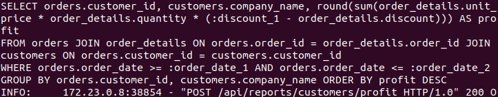
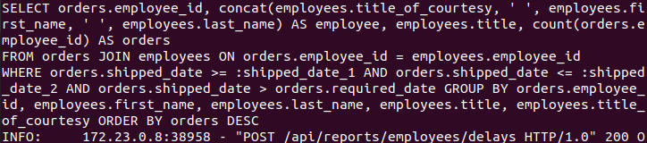

### Realizacja serwisu raportów

##### [/api/reports/customers/profit](https://github.com/ethru/northwind_psql/blob/master/reports-service/app/api/reports.py#L14-L18)

[Zapytanie](https://github.com/ethru/northwind_psql/blob/master/reports-service/app/api/db.py#L63-L87):

```python
async def get_sales_by_customer(from_date, to_date):
    """Return report about sales by customer in set period of time."""
    expression = order_details.c.unit_price * order_details.c.quantity * (1 - order_details.c.discount)
    query = select(
        [
            orders.c.customer_id,
            customers.c.company_name,
            func.round(func.sum(expression)).label('profit')
        ]
    ).select_from(
        join(join(orders, order_details, orders.c.order_id == order_details.c.order_id),
             customers, orders.c.customer_id == customers.c.customer_id)
    ).where(
        and_(
            orders.c.order_date >= from_date,
            orders.c.order_date <= to_date,
        )
    ).group_by(
        orders.c.customer_id,
        customers.c.company_name,
    ).order_by(
        desc('profit')
    )
    print(query)
    return await database.fetch_all(query=query)
```

Pod zmienną `expression` zapisujemy wyrażenie obliczające wartość wpisu w `order_details`. Następnie tworzymy zapytanie 
`select`, do którego przekazujemy listę interesujących nas kolumn `[orders.c.customer_id, customers.c.company_name, 
func.round(func.sum(expression)).label('profit')`]. Ostatni element to funkcja zaokrąglająca sumę wcześniej obliczanych 
wyrażeń. Zostanie ona wypisana pod etykietą `profit`. Kolejnym krokiem jest sprecyzowanie skąd dane mają być pobierane 
za pomocą funkcji `join` z modułu `sqlalchemy.sql` łączymy poszczególne tabele po id. W `where` dodajemy przy użyciu 
`_and` (również z `sqlalchemy.sql`) warunki do zapytania - zakres dat. Następnie grupujemy dane - `group_by` i ustalamy 
kolejność ich wypisania `order_by` wraz z funkcją `desc('profit')`.


Log z konsoli:



Wynik dla zakresu "1996-07-10" - "1996-07-17":


<br />
<br />
<br />
<br />

##### [/api/reports/employees/activity](https://github.com/ethru/northwind_psql/blob/master/reports-service/app/api/reports.py#L21-L25)

[Zapytanie](https://github.com/ethru/northwind_psql/blob/master/reports-service/app/api/db.py#L14-L60):

```python
async def get_employees_activity(from_date, to_date):
    """Return report about employees activity in set period of time."""
    conditions = [
        orders.c.shipped_date >= from_date,
        orders.c.shipped_date <= to_date,
    ]
    return await get_employees_report(conditions)


async def get_employees_report(conditions: list):
    """Return report about employees according to set conditions."""
    query = select(
        [
            orders.c.employee_id,
            await get_full_employee_name(),
            employees.c.title,
            func.count(orders.c.employee_id).label('orders')
        ]
    ).select_from(
        orders.join(
            employees, orders.c.employee_id == employees.c.employee_id
        )
    ).where(
        and_(
            *conditions
        )
    ).group_by(
        orders.c.employee_id,
        employees.c.first_name,
        employees.c.last_name,
        employees.c.title,
        employees.c.title_of_courtesy
    ).order_by(
        desc('orders')
    )
    print(query)
    return await database.fetch_all(query=query)


# Funkcja pomocnicza - formatująca dane pracownika
async def get_full_employee_name():
    """Return concat function with full employee name."""
    blank = text("' '")
    full_name = [employees.c.title_of_courtesy, blank, employees.c.first_name, blank, employees.c.last_name]
    return func.concat(*full_name).label('employee')
```

Z dat przekazanych do funkcji `get_employees_activity` formowany jest warunek, z którym następnie wywołana jest funkcja 
`get_employees_report`. Tworzone zostaje w niej zapytanie `select` z listą pozycji do wypisania. Jedną z nich jest wynik 
z `get_full_employee_name()`, która łączy za pomocą `func.concat` z modułu `sqlalchemy.sql` dane odnośnie pracownika i 
zwraca je pod etykietą `employee`. Użyta również zostaje `func.count` zliczająca ilość rekordów. W następnym kroku 
precyzujemy skąd dane mają być pobrane wpisując w `select_from` połączenie (`join`) kolumny `orders` z `employees` po 
id. Do `where` zostają wypakowane warunki przekazane do funkcji `get_employees_report`. Na końcu występuje grupowanie 
wyników po właściwych kolumnach i uszeregowanie ich malejąco (`desc`) wedłuch etykiety `orders`.

Log z konsoli:


Wynik dla zakresu "1996-07-10" - "1996-07-17":


<br />
<br />
<br />
<br />

##### [/api/reports/employees/delays](https://github.com/ethru/northwind_psql/blob/master/reports-service/app/api/reports.py#L28-L32)

[Zapytanie](https://github.com/ethru/northwind_psql/blob/master/reports-service/app/api/db.py#L23-L60):
```python
async def get_employees_shipment_delays(from_date, to_date):
    """Return report about employees shipment delays in set period of time."""
    conditions = [
        orders.c.shipped_date >= from_date,
        orders.c.shipped_date <= to_date,
        orders.c.shipped_date > orders.c.required_date
    ]
    return await get_employees_report(conditions)


async def get_employees_report(conditions: list):
    """Return report about employees according to set conditions."""
    query = select(
        [
            orders.c.employee_id,
            await get_full_employee_name(),
            employees.c.title,
            func.count(orders.c.employee_id).label('orders')
        ]
    ).select_from(
        orders.join(
            employees, orders.c.employee_id == employees.c.employee_id
        )
    ).where(
        and_(
            *conditions
        )
    ).group_by(
        orders.c.employee_id,
        employees.c.first_name,
        employees.c.last_name,
        employees.c.title,
        employees.c.title_of_courtesy
    ).order_by(
        desc('orders')
    )
    print(query)
    return await database.fetch_all(query=query)


# Funkcja pomocnicza - formatująca dane pracownika
async def get_full_employee_name():
    """Return concat function with full employee name."""
    blank = text("' '")
    full_name = [employees.c.title_of_courtesy, blank, employees.c.first_name, blank, employees.c.last_name]
    return func.concat(*full_name).label('employee')
```

Z dat przekazanych do funkcji `get_employees_delays` formowany jest warunek określający zakres z kolumny `shipped_date` 
tabeli `orders`. Zwracane są te wpisy, w których `shipped_date` przekracza `required_date` dzięki czemu możemy zobaczyć 
ilość opóźnień w wysyłce przypadającą na danego pracownika w zadanym przedziale czasowym. Następuje wywołanie 
`get_employees_report`, które dokładnie zostało opisane powyżej.

Log z konsoli:



Wynik dla zakresu "1996-07-10" - "1997-07-10":


<br />
<br />
<br />
<br />

##### [/api/reports/products/popularity](https://github.com/ethru/northwind_psql/blob/master/reports-service/app/api/reports.py#L35-L39)

[Zapytanie](https://github.com/ethru/northwind_psql/blob/master/reports-service/app/api/db.py#L90-L116):

```python
async def get_products_by_popularity(from_date, to_date):
    """Return report about products by popularity in set period of time."""
    query = select(
        [
            order_details.c.product_id,
            products.c.product_name,
            categories.c.category_name,
            func.sum(order_details.c.quantity).label('sold')
        ]
    ).select_from(
        join(join(join(orders, order_details, orders.c.order_id == order_details.c.order_id),
                  products, products.c.product_id == order_details.c.product_id),
             categories, products.c.category_id == categories.c.category_id)
    ).where(
        and_(
            orders.c.order_date >= from_date,
            orders.c.order_date <= to_date,
        )
    ).group_by(
        order_details.c.product_id,
        products.c.product_name,
        categories.c.category_name,
    ).order_by(
        desc('sold')
    )
    print(query)
    return await database.fetch_all(query=query)
```

Do `get_products_by_popularity` przekazujemy zakres dat by zobaczyć produkty cieszące się największym zainteresowaniem 
w tym przedziale czasowym. Formowane zostaje zapytanie `select`, które zwróci nazwę, id produktu oraz kategorię, do 
której on przynależy jak również sume jego zamówień `func.sum(order_details.c.quantity).label('sold')` w zadanym 
przedziale czasowym (sprecyzowanym za pomocą `where`). Dane łączone są za pomocą odpowiedniej kombinacji funkcji `join` 
przekazanej do `select_from`. Na końcu występuje grupowanie (`group_by`) oraz szeregowanie malejąco po etykiecie `sold` - 
`.order_by(desc('sold'))`.

Log z konsoli:


Wynik dla zakresu "1996-07-10" - "1996-07-17":


<br />
<br />
<br />
<br />

##### [/api/reports/products/reorder](https://github.com/ethru/northwind_psql/blob/master/reports-service/app/api/reports.py#L42-L46)

[Zapytanie](https://github.com/ethru/northwind_psql/blob/master/reports-service/app/api/db.py#L119-L148):

```python
async def get_products_to_reorder():
    """Return report about products to reorder."""
    available = products.c.units_in_stock - products.c.units_on_order
    contact = func.concat(suppliers.c.contact_title, text("': '"), suppliers.c.contact_name,
                          text("' via '"), suppliers.c.phone)
    to_reorder = available - products.c.reorder_level

    query = select(
        [
            products.c.product_id,
            products.c.product_name,
            categories.c.category_name,
            products.c.units_in_stock,
            products.c.units_on_order,
            available.label('units_available'),
            products.c.reorder_level,
            suppliers.c.company_name.label('supplier'),
            contact.label('contact')
        ]
    ).select_from(
        join(join(products, suppliers, products.c.supplier_id == suppliers.c.supplier_id),
             categories, products.c.category_id == categories.c.category_id)
    ).where(
        and_(
            products.c.discontinued == 0,
            to_reorder <= 0
        )
    )
    print(query)
    return await database.fetch_all(query=query)
```

Funkcja `get_products_to_reorder()` zwraca nam wszystkie produkty, które wymagają zamówienia większej ilości jednostek.
W zmiennej `available` przechowujemy informację o produktach dostępnych w magazynie z wyłączeniem tych, które są 
aktualnie zamówione. Z kolei `contact` sumuje dane dostawcy poszczególnych produktów złączone za pomocą 
`func.concat`. `to_reorder` to wynik odjęcia z dostępnych jednostek ilości znajdującej się w `products.c.reorder_level`.
W zapytaniu `select` umieszczamy wszelkie informacje potrzebne do złożenia zamówienia na produkt. Łączymy odpowiednie 
tabele przy użyciu `select_from` oraz `join`. W warunkach (`where`) określamy, że produkt musi być w sprzedaży 
(`products.c.discontinued == 0`), a stan poniżej wartości do ponownego zamówienia (`to_reorder <= 0`).

Log z konsoli:


Wynik:


