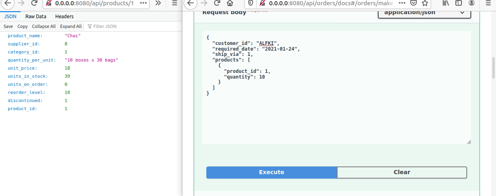
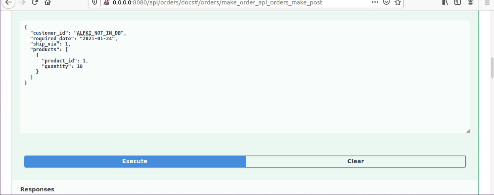

### Zamówienia



Powyżej możemy zobaczyć przykładowe złożenie zamówienia (nie sfinalizowane).

Po wysłaniu właściwego zapytania tworzone są wpisy za pomocą transakcji w tabeli `orders`, `order_details` oraz 
modyfikowana wartość `units_on_order` w `products`. Zwracany jest link do płatności za pomocą sandbox'u 
[serwisu PayPal](https://www.sandbox.paypal.com/). W między czasie wywoływana jest w tle asynchroniczna funkcja 
odpowiedzialna za cykliczne sprawdzanie statusu płatności. Kiedy po zadanej ilości prób (na potrzeby prezentacji liczba 
znacznie zmniejszona) wciąż nie ma wpłaty status zamówienia zostaje ustawiony na `CANCELED`, a `units_on_order` 
wszystkich produktów wycofane w odpowiedniej transakcji. Wpisy w `orders` oraz `order_details` pozostają dla możliwości 
ponowienia płatności w póżniejszym czasie.

Kiedy pracownik nadaje paczkę ma dostępny endpoint 
[send](https://github.com/ethru/northwind_psql/blob/master/orders-service/app/api/orders.py#L98-L106), w którym podaje 
`order_id` oraz `freight`. W tym momencie za pomocą transakcji ze wszystkich produktów z zamówienia zostaje zredukowana 
ilość `units_in_stock` oraz usunięta `units_on_order`.

Za walidację przesyłanych danych odpowiedzialny jest model modułu `pydantic` - `Order` opisany bardziej szczegółowo 
poniżej. W niektórych miejscach podnoszone są również wyjątki `raise HTTPException(...)` z modułu `fastapi`. Co zostanie 
przedstawione w opisie kodu.

#### Realizacja

Endpoint służący do składania zamówień wygląda 
[następująco](https://github.com/ethru/northwind_psql/blob/master/orders-service/app/api/orders.py#L88-L94):

```python
@orders.post('/make', status_code=201, dependencies=[Depends(authorize)])
async def make_order(payload: Order):
    """Make order for products."""
    details = await prepare_order(payload)
    payment = await db.orders.make(payload.products, details)
    loop.create_task(process_payment_status(**payment))
    return PAY_URL + payment['payment_id']
```

Jest on zależny od funkcji autoryzacji (`dependencies=[Depends(authorize)]`) komunikującej się z `auth-service`. 
Przyjmuje on dane (`payload`) reprezentowane przez klasę `Order` opisaną poniżej. Natępnie korzysta z funkcji 
`prepare_order` odpowiedzalnej za przygotowanie danych zamówienia. Ma ona 
[postać](https://github.com/ethru/northwind_psql/blob/master/orders-service/app/api/orders.py#L38-L45):

```python
async def prepare_order(payload: Order) -> OrderIn:
    """Fill all additional data needed to make an order."""
    address = await get_customer_address(payload.customer_id)
    if payload.address:
        address = payload.address

    employee = await db.users.get_employee()
    return OrderIn(employee_id=employee, order_date=date.today(), **payload.dict(), **address.dict())
```

Najpierw [pobierany jest adres użytkownika
](https://github.com/ethru/northwind_psql/blob/master/orders-service/app/api/orders.py#L21-L26):

```python
async def get_customer_address(customer_id: str) -> Address:
    """Return formatted customer address."""
    customer = await db.users.get_customer_by_id(customer_id)
    if not customer:
        raise HTTPException(status_code=404, detail='Customer with set id not found.')
    return Address(**customer)
```

Za pomocą [db.users](https://github.com/ethru/northwind_psql/blob/master/orders-service/app/api/db/users.py#L7-L9):

```python
async def get_customer_by_id(customer_id: str):
    """Get customer details from database by set id."""
    return await database.fetch_one(query=customers.select().where(customers.c.customer_id == customer_id))
```

Jeśli go nie otrzymamy wtedy wywołujemy wyjątek `if not customer: raise HTTPException(status_code=404, ...)`. W przeciwnym wypadku 
zwracany jest odpowiednio sformatowany adres. 

Wracając do funkcji `prepare_order`:

```python
    address = await get_customer_address(payload.customer_id)
    if payload.address:
        address = payload.address
```

Pobranie adresu użytkownika zapewnia sprawdzenie czy znajduje się on w bazie danych. Następnie jeśli podał on inny 
adres wysyłki w zapytaniu wtedy to on jest przetwarzany.

Kolejna linijka `employee = await db.users.get_employee()` pobiera id pracownika odpowiedzialnego za realizacje 
zamówienia. Funkcja prezentuje się 
[tak](https://github.com/ethru/northwind_psql/blob/master/orders-service/app/api/db/users.py#L12-L15):

```python
async def get_employee():
    """Return id of randomly picked sales representative."""
    sales = await database.fetch_all(query=employees.select().where(employees.c.title == 'Sales Representative'))
    return random.choice(sales)['employee_id']
```

Wybiera ona losowego pracownika sprzedaży z bazy i zwraca jego id. Po wykonaniu tych wszystkich kroków funkcja 
`prepare_order` zwraca obiekt, który może zostać dodany do bazy `return OrderIn(employee_id=employee, 
order_date=date.today(), **payload.dict(), **address.dict())`.

Teraz wróćmy do omawiania docelowej funkcji `make_order`, w której kolejnym krokiem jest stworzenie zamówinia z 
otrzymanych danych `payment = await db.orders.make(payload.products, details)`. Wywołana jest transakcja z pliku 
[orders](https://github.com/ethru/northwind_psql/blob/master/orders-service/app/api/db/orders.py#L53-L78):

```python
@database.transaction()
async def make(products: List[Product], user_data: OrderIn):
    """Create order in database.
    Fill order details with products. Set units on order. Make payment request via Paypal. Return dict with order_id and
    payment_id.
    """
    try:
        order_id = await add_order(user_data)
    except ForeignKeyViolationError:
        raise HTTPException(status_code=404, detail='Shipper with set id not found.')
    total_cash = 0

    for product in products:
        unit_price = await order(product.product_id, product.quantity)

        details = OrderDetails(order_id=order_id, unit_price=unit_price, **product.dict())
        await check_query_result(await add_order_details(details))

        cash = product.quantity * unit_price
        total_cash += cash

    payment_id = await make_request(total_cash)
    result = await update({'order_id': order_id, 'paypal_id': payment_id, 'status': 'PENDING'})
    await check_query_result(result)
    return {'order_id': order_id, 'payment_id': payment_id}
```

Tworzy ona najpierw 
[wpis](https://github.com/ethru/northwind_psql/blob/master/orders-service/app/api/db/orders.py#L27-L30) 
w tabeli `orders` z przesłanych danych:

```python

async def add_order(payload: OrderIn):
    """Create new empty order in database and return its id."""
    query = orders.insert().values(**payload.dict()).returning(orders)
    return await database.execute(query=query)
```

Jeśli podczas jego tworzenia wystąpi błąd związany z kluczem obcym dostawcy to transakcja zostanie przerwana i błąd 
`raise HTTPException(status_code=404, detail='Shipper with set id not found.')` zwrócony użytkownikowi.

W przeciwnym wypadku wprowadzane są dane wszystkich zamawianych produktów. Najpierw wywoływana jest 
[funkcja](https://github.com/ethru/northwind_psql/blob/master/orders-service/app/api/db/products.py#L28-L40) 
z pliku `api/db/products.py` edytująca jednostki w tabeli `products`.

```python
async def order(product_id: int, quantity: int):
    """Order product in set quantity.
    Return unit price if units are available in stock. Update units_on_order in product details.
    """
    product = await select_for_update(product_id)
    if not product:
        raise HTTPException(status_code=404, detail='Product with set id not found.')
    await check_availability(product, quantity)

    data = ProductUpdate(product_id=product_id, units_on_order=product['units_on_order'] + quantity)
    await update(data)
    return product['unit_price']
```

[Wybierany](https://github.com/ethru/northwind_psql/blob/master/orders-service/app/api/db/products.py#L7-L10) 
jest w niej produkt do aktualizacji (parameter for_update=True blokujący zasób).

```python
async def select_for_update(product_id: int):
    """Select product by id for update."""
    query = products.select(for_update=True).where(products.c.product_id == product_id)
    return await database.fetch_one(query=query)
```

Później [sprawdzana](https://github.com/ethru/northwind_psql/blob/master/orders-service/app/api/db/products.py#L21-L25) 
ilość dostępnych jednostek. W wypadku, gdy jest niewystarczająca wywoływany jest wyjątek.

```python
async def check_availability(product, quantity):
    """Raise exception when there is not enough product units."""
    available = product['units_in_stock'] - product['units_on_order']
    if available < quantity:
        raise HTTPException(status_code=422, detail=f'Not enough available {product["product_name"]} units.')
```

Ostatecznie wpis zostaje 
[zaktualizowany](https://github.com/ethru/northwind_psql/blob/master/orders-service/app/api/db/products.py#L13-L18):

```python
async def update(data: ProductUpdate) -> int:
    """Update product with set id in database."""
    query = products.update().where(
        products.c.product_id == data.product_id
    ).values(**data.dict(exclude_unset=True)).returning(products)
    return await database.execute(query=query)
```

i cena jednostkowa produktu zwrócona `return product['unit_price']`.

Teraz kolejnym krokiem transakcji jest dodanie wpisu do `order_details`. Odbywa się to przez przekazanie danych do 
modelu `OrderDetails` i wywołanie funkcji `add_order_details`, której wynik kierowany jest bezpośrednio do funkcji 
`check_query_result` (wyrzuci wyjątek kiedy odpowiedź z bazy będzie pusta - rekord nie dodany). Odpowiadają za to 
linijki:

```python
        details = OrderDetails(order_id=order_id, unit_price=unit_price, **product.dict())
        await check_query_result(await add_order_details(details))
```
a sama funkcja
[add_order_details](https://github.com/ethru/northwind_psql/blob/master/orders-service/app/api/db/orders.py#L33-L36) 
prezentuje się następująco:

```python
async def add_order_details(details: OrderDetails):
    """Create new empty order in database and return its id."""
    query = order_details.insert().values(**details.dict()).returning(order_details)
    return await database.execute(query=query)
```

Ceny produktów sumowane są do zmiennej `total_cash`:

```python
        cash = product.quantity * unit_price
        total_cash += cash
```

Po przejściu pętli przez wszystkie przesłane produkty. Wywoływana jest funkcja `make_request` (`payment_id = await 
make_request(total_cash)`) z modułu odpowiedzialnego za 
[płatności](https://github.com/ethru/northwind_psql/blob/master/orders-service/app/api/payments.py#L1-L44). Tworzy ona 
zlecenie zapłaty za pomocą serwisu PayPal na przesłaną kwotę oraz zwraca id płatności.

Teraz możemy zaktualizować dane zamówienia w tabeli `orders` o status płatności i jej id:

```python
    result = await update({'order_id': order_id, 'paypal_id': payment_id, 'status': 'PENDING'})
    await check_query_result(result)
```

oraz od razu sprawdzić wynik tego zapytania by wywołać wyjątek w przypadku, gdy coś poszło nie tak.

Kiedy transakcja przeszła pomyślnie wszystkie powyższe kroki zwracamy id płatności wraz z id zamówienia: `return 
{'order_id': order_id, 'payment_id': payment_id}`.

Teraz jedyne co należy zrobić w kolejnym kroku `make_order` to wywołać asynchronicznie funkcję 
`loop.create_task(process_payment_status(**payment))`, która cyklicznie w tle będzie sprawdzała status płatności i ją 
właściwie [przetwarzała](https://github.com/ethru/northwind_psql/blob/master/orders-service/app/api/orders.py#L48-L60) 
oraz zwrócić link do płatności.

```python
async def process_payment_status(order_id, payment_id, calls=3):
    """Check payment status.
    If it is correct make update in database otherwise calls self again. After few calls cancel order and update data.
    """
    await asyncio.sleep(10)
    if await is_paid(payment_id):
        await db.orders.update({'order_id': order_id, 'status': 'PAID'})
        return True
    if calls:
        loop.create_task(process_payment_status(order_id, payment_id, calls - 1))
    else:
        return await db.process_order(order_id, True)
```

Jeśli funkcja [is_paid](https://github.com/ethru/northwind_psql/blob/master/orders-service/app/api/payments.py#L37-L44) 
zwróci wartość `True` to status w tabeli `orders` zostanie zaktualizowany jako `PAID`. W wypadku kiedy `parameter` calls
ma wartość większą od 0 funkcja wywoła się ponownie po odczekaniu zadaniej ilości sekund (na potrzeby prezentacji są 
tylko 3 wywołania w odstępach po 10 sekund). Kiedy wartość `calls` osiągnie 0 to zostanie uruchomiona transakcja 
[process_order](https://github.com/ethru/northwind_psql/blob/master/orders-service/app/api/db/__init__.py#L7-L18) z 
parametrem `remove=True`:

```python
@database.transaction()
async def process_order(order_id: int, remove: bool):
    """Cancel order if remove flag set to True otherwise send order and update products."""
    details = await orders.get_details_by_id(order_id)

    for data in details:
        await (products.cancel if remove else products.send)(data['product_id'], data['quantity'])

    result = await orders.update({'order_id': order_id, 'status': 'CANCELED' if remove else 'SENT'})
    if result == order_id:
        return True
    return False
```

Pobierane są w niej wszystkie detale zamówienia. Następnie iterując po ich danych wywołana zostaje funkcja 
[products.cancel](https://github.com/ethru/northwind_psql/blob/master/orders-service/app/api/db/products.py#L55-L60):

```python
async def cancel(product_id: int, quantity: int):
    """Reduce units on order by set quantity."""
    product = await select_for_update(product_id)

    data = ProductUpdate(product_id=product_id, units_on_order=product['units_on_order'] - quantity)
    await update(data)
```

która usuwa jednostki z `units_on_order`. Po przejściu pętli przez wszystkie zamówione produkty status zamówienia 
zostaje zmieniony na `CANCELED`: `result = await orders.update({'order_id': order_id, 'status': 'CANCELED' if remove 
else 'SENT'})`. Wpisy w tabeli `order_details` oraz `orders` są pozostawione w celu ponownego przetworzenia płatności w 
dalszej przyszłości.

**Nadawanie przesyłki**: podczas tej czynności pracownik korzysta z endpointu
[send](https://github.com/ethru/northwind_psql/blob/master/orders-service/app/api/orders.py#L98-L106), w którym podaje 
`order_id` oraz `freight`. Użyta jest opisana wcześnie transakcja `process_order`, ale z flagą `remove=False`. Działa 
ona jak opisano powyżej z tym wyjątkiem, że zamiast wywołać `products.cancel` wykona `products.send`, a status 
zamówienia zmieni na `SENT`. Funkcja `send` wygląda 
[następująco](https://github.com/ethru/northwind_psql/blob/master/orders-service/app/api/db/products.py#L43-L52):

```python
async def send(product_id: int, quantity: int):
    """Reduce units on order and units in stock by set quantity."""
    product = await select_for_update(product_id)

    data = ProductUpdate(
        product_id=product_id,
        units_in_stock=product['units_in_stock'] - quantity,
        units_on_order=product['units_on_order'] - quantity
    )
    await update(data)
```

Usunięte zostają jednostki w tabeli `products` zarówno w `units_in_stock` jak i `units_on_order`.

#### Użyte modele danych

##### SQLAlchemy

Tabela `orders` została odwzorowana w nastepujący [sposób
](https://github.com/ethru/northwind_psql/blob/master/orders-service/app/api/models.py#L28-L50):

```python
orders = Table(
    'orders',
    metadata,
    Column('order_id', Integer, primary_key=True),
    Column('customer_id', String),
    Column('employee_id', Integer),
    Column('order_date', Date),
    Column('required_date', Date, nullable=True),
    Column('shipped_date', Date, nullable=True),
    Column('ship_via', Integer),
    Column('freight', Float, nullable=True),
    Column('ship_name', String),
    Column('ship_address', String),
    Column('ship_city', String),
    Column('ship_region', String),
    Column('ship_postal_code', String),
    Column('ship_country', String),
    Column('paypal_id', String, nullable=True),
    Column('status', String, nullable=True),
    ForeignKeyConstraint(['customer_id'], ['customers.customer_id']),
    ForeignKeyConstraint(['employee_id'], ['employees.employee_id']),
    ForeignKeyConstraint(['ship_via'], ['shippers.shipper_id'])
)
```
Do pól użytych w klasycznej wersji Northwind'a dodane zostały `paypal_id` oraz `status`. Służą one do przechowywania 
kodu potrzebnego do realizacji płatności oraz statusu niezbędnego przy przetwarzaniu zamówienia.

##### Pydantic

Powyższy model został również 
[przełożony](https://github.com/ethru/northwind_psql/blob/master/orders-service/app/api/models.py#L134-L149) jako 
rozszerzenie klasy `BaseModel` modułu `pydantic`:

```python
class OrderIn(BaseModel):
    customer_id: str
    employee_id: int
    order_date: date
    required_date: Optional[date]
    shipped_date: Optional[date]
    ship_via: int
    freight: Optional[float]
    ship_name: str
    ship_address: str
    ship_city: str
    ship_region: Optional[str]
    ship_postal_code: Optional[str]
    ship_country: str
    paypal_id: Optional[str]
    status: Optional[str]
```

##### Walidacja

Do zapewnienia poprawności danych przesyłanych do api został stworzony następujący 
[model](https://github.com/ethru/northwind_psql/blob/master/orders-service/app/api/models.py#L120-L131):

```python
class Order(BaseModel):
    customer_id: str
    required_date: Optional[date] = None
    ship_via: int
    address: Optional[Address] = None
    products: List[Product]

    @validator('required_date')
    def value_must_be_greater_than_0(cls, required):
        if date.today() < required:
            return required
        raise ValueError('required date must be greater than order date')
```

Wymaga on podania id klienta, do którego ma dotrzeć zamównie, daty dostarczenia (opcjonalnie), id dostawcy, adresu 
dostawy (opcjonalnie - jeśli go nie ma zostanie pobrany adres klienta z bazy) oraz listy zawierającej id zamawianych 
produktów wraz z ich ilością.



##### Pozostałe

Wszystkie modele użyte przy przetwarzaniu zamówień dostępne są w pliku `models.py` serwisu `orders`. Dostępne 
[pod linkiem](https://github.com/ethru/northwind_psql/blob/master/orders-service/app/api/models.py#L1-L160).
